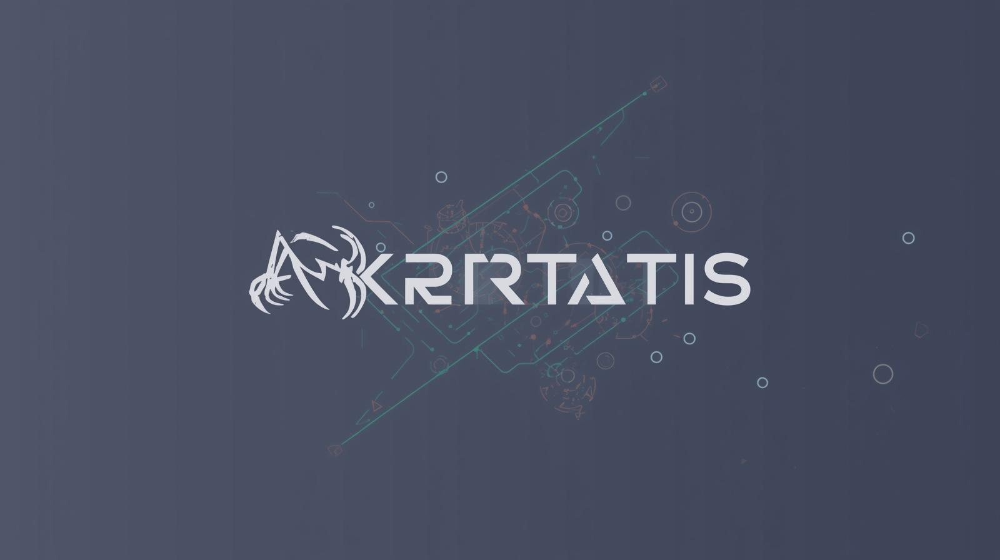

# Akroatis Port Scanner

A powerful and user-friendly port scanning tool built in Rust, featuring both command-line and graphical user interfaces. The scanner performs TCP connect scans to identify open ports and their associated services.



## 🚀 Features

### Core Functionality
- **TCP Connect Scanning**: Reliable port scanning using TCP connections
- **Service Detection**: Automatic identification of common services (HTTP, SSH, FTP, etc.)
- **IPv4/IPv6 Support**: Full support for both IPv4 and IPv6 addresses
- **Fast Scanning**: Optimized for performance with configurable timeouts

### GUI Features (Akroatis)
- **Real-time Status Bar**: Color-coded status indicators showing scan progress
- **Progress Information**: Detailed feedback during scanning operations
- **Report Downloads**: Export scan results as timestamped .txt files
- **Interactive Controls**: Easy-to-use interface with clear/reset functionality
- **Error Handling**: Comprehensive error messages and user feedback

### CLI Features (Port Sniffer)
- **Command-line Interface**: Traditional terminal-based operation
- **Multi-threading Support**: Configurable thread counts for faster scanning
- **Progress Indicators**: Visual progress bars during scanning
- **Flexible Output**: Clean, organized results display

## 📋 Requirements

### System Requirements
- **Operating System**: Windows, macOS, or Linux
- **Memory**: 256MB RAM minimum, 512MB recommended
- **Storage**: 50MB free space for installation and temporary files

### Software Dependencies
- **Rust**: Version 1.70.0 or later ([Install Rust](https://rustup.rs/))
- **Cargo**: Included with Rust installation

### Network Requirements
- **Permissions**: May require elevated privileges for certain port ranges (< 1024)
- **Firewall**: Ensure outbound connections are not blocked
- **Network Access**: Direct access to target IP addresses

## 🔧 Installation

### Option 1: Clone and Build from Source

```bash
# Clone the repository
git clone https://github.com/yourusername/akroatis-port-scanner.git
cd akroatis-port-scanner

# Build the project
cargo build --release
```

### Option 2: Download Pre-built Binaries

1. Go to [Releases](https://github.com/yourusername/akroatis-port-scanner/releases)
2. Download the appropriate binary for your operating system
3. Extract and run the executable

## 💻 Usage

### Graphical User Interface (GUI)

```bash
# Run the GUI version
cargo run --bin akroatis
# Or with pre-built binary:
./akroatis.exe  # Windows
./akroatis      # Linux/macOS
```

#### GUI Instructions:
1. **Launch the application** using the command above
2. **Enter IP Address**: Type the target IP address in the input field
3. **Configure Options** (optional):
   - Check "Randomize Ports" for unpredictable scanning order
   - Check "Use SYN Scan" (currently informational)
4. **Start Scanning**: Click the "Engage" button to begin
5. **Monitor Progress**: Watch the status bar and progress information
6. **View Results**: Open ports and services are displayed in the results area
7. **Download Reports**: Click "Download .txt" to save results as a timestamped file
8. **Clear Data**: Use the "Clear" button to reset for new scans

### Command Line Interface (CLI)

```bash
# Basic scan of first 1024 ports
cargo run --bin port_sniffer -- 192.168.1.1

# Scan with custom thread count
cargo run --bin port_sniffer -- -j 8 192.168.1.1

# Display help
cargo run --bin port_sniffer -- --help
```

#### CLI Options:
- `-j, --threads <THREADS>`: Number of scanning threads (default: 4)
- `-h, --help`: Display help information

#### CLI Output Example:
```
░░░░░░░░░░░░░░░░░░░░░░░░░░░░░░░░░░░░░░░░░░░░░░░░░░░░░░░░░░░░░░░░░░░░░░░░░░░░░░░░░░░░░░░░░░░░░░░░░░░░░ 1/1024
...
Port scan complete!

22 is open - SSH
80 is open - HTTP
443 is open - HTTPS
```

## 📊 Output Formats

### GUI Results Format
```
Port: 22, Status: open, Service: SSH
Port: 80, Status: open, Service: HTTP
Port: 443, Status: open, Service: -
```

### CLI Results Format
```
22 is open - SSH
80 is open - HTTP
443 is open
```

### Report File Format (.txt)
```
Akroatis Port Scanner Report
===========================

Target IP: 192.168.1.1
Scan Time: 2024-01-12 15:30:45 UTC
Randomize: No
SYN Scan: No

Results:
--------
Port: 22, Status: open, Service: SSH
Port: 80, Status: open, Service: HTTP
Port: 443, Status: open, Service: -

Total open ports: 3
```

## 🔒 Security & Ethical Considerations

### Legal Usage
- **Obtain Permission**: Only scan networks and systems you own or have explicit permission to test
- **Follow Laws**: Comply with local laws and regulations regarding network scanning
- **Respect Privacy**: Do not scan systems without authorization

### Security Best Practices
- **Rate Limiting**: Built-in delays prevent overwhelming target systems
- **Responsible Scanning**: Use appropriate timing to avoid disrupting services
- **Data Handling**: Reports contain sensitive network information - handle appropriately

### Performance Notes
- **Network Impact**: Scanning generates network traffic that may be logged
- **System Resources**: Multi-threaded scanning uses system resources
- **Timeout Handling**: Configurable timeouts prevent hanging on unresponsive ports

## 🐛 Troubleshooting

### Common Issues

#### "Permission Denied" Errors
```
Error: Permission denied (os error 10013)
```
**Solution**: Run with elevated privileges for ports < 1024:
```bash
# Windows
runas /user:Administrator "cargo run --bin port_sniffer -- 192.168.1.1"

# Linux/macOS
sudo cargo run --bin port_sniffer -- 192.168.1.1
```

#### Compilation Errors
```
error[E0463]: can't find crate for `eframe`
```
**Solution**: Install dependencies and rebuild:
```bash
cargo clean
cargo build
```

#### GUI Won't Start
```
thread 'main' panicked at 'called `Result::unwrap()` on an `Err` value'
```
**Solution**: Ensure all dependencies are installed and try running in release mode:
```bash
cargo run --bin akroatis --release
```

### Network Issues

#### No Open Ports Found
- Verify target IP address is reachable (`ping <ip>`)
- Check firewall settings on target system
- Try scanning localhost first: `127.0.0.1`

#### Connection Timeouts
- Increase timeout values in the code
- Check network connectivity
- Verify target system is online

### Performance Issues
- Reduce thread count for slower networks
- Add delays between scans
- Use release builds for better performance

## 🛠️ Development

### Project Structure
```
port_sniffer/
├── src/
│   ├── lib.rs          # Core scanning library
│   ├── main.rs         # CLI application
│   └── bin/
│       └── akroatis.rs # GUI application
├── Cargo.toml          # Project configuration
├── README.md          # This file
└── Akroatis.jpg      # Application icon
```

### Building for Development
```bash
# Debug build
cargo build

# Release build (optimized)
cargo build --release

# Run tests
cargo test

# Run specific binary
cargo run --bin akroatis    # GUI
cargo run --bin port_sniffer # CLI
```

### Code Organization
- **`lib.rs`**: Core scanning functionality and data structures
- **`main.rs`**: Command-line interface and argument parsing
- **`akroatis.rs`**: Graphical user interface using eframe/egui

## 🤝 Contributing

We welcome contributions! Please follow these guidelines:

### Development Setup
1. Fork the repository
2. Create a feature branch: `git checkout -b feature/your-feature`
3. Make your changes
4. Add tests for new functionality
5. Ensure all tests pass: `cargo test`
6. Submit a pull request

### Code Standards
- Follow Rust formatting guidelines: `cargo fmt`
- Run clippy for linting: `cargo clippy`
- Add documentation for public APIs
- Write tests for new features

### Reporting Issues
- Use GitHub Issues for bug reports and feature requests
- Include detailed steps to reproduce
- Specify your operating system and Rust version
- Attach relevant log output

## 📄 License

This project is licensed under the MIT License - see the [LICENSE](LICENSE) file for details.

## 🙏 Acknowledgments

- Built with [Rust](https://www.rust-lang.org/) for performance and safety
- GUI powered by [egui](https://github.com/emilk/egui) and [eframe](https://github.com/emilk/eframe)
- Progress bars by [indicatif](https://github.com/console-rs/indicatif)
- Network functionality by [pnet](https://github.com/libpnet/libpnet)

## 📞 Support

- **Issues**: [GitHub Issues](https://github.com/yourusername/akroatis-port-scanner/issues)
- **Discussions**: [GitHub Discussions](https://github.com/yourusername/akroatis-port-scanner/discussions)
- **Documentation**: This README and inline code comments

---

**Disclaimer**: This tool is for educational and authorized security testing purposes only. Users are responsible for complying with applicable laws and obtaining proper authorization before scanning networks or systems.
